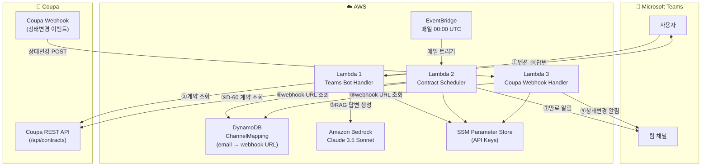
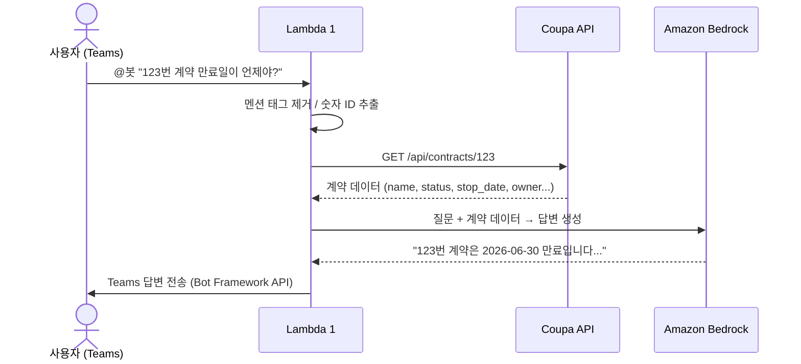
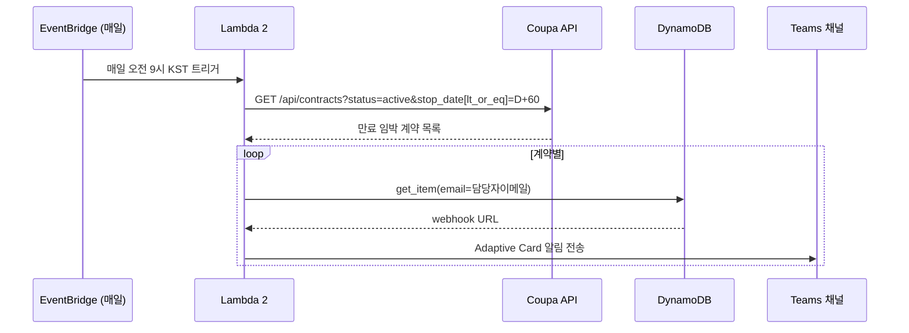
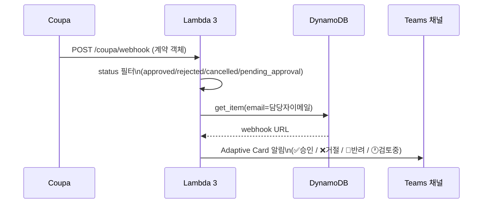

# Coupa × Teams 연동 챗봇 아키텍처

## 1. 전체 시스템 구성



---

## 2. Lambda 1 - Teams Bot (질의응답)



---

## 3. Lambda 2 - 계약 만료 스케줄러 (D-60 알림)



---

## 4. Lambda 3 - Coupa 상태변경 알림



---

## 5. DynamoDB 채널 매핑 구조

```
ChannelMapping 테이블
┌─────────────────────────┬──────────────────────────────────────┬──────────────┐
│ email (PK)              │ webhook_url                          │ channel_name │
├─────────────────────────┼──────────────────────────────────────┼──────────────┤
│ hong@company.com        │ https://xxx.webhook.office.com/...   │ 구매팀       │
│ kim@company.com         │ https://yyy.webhook.office.com/...   │ IT팀         │
│ lee@company.com         │ https://zzz.webhook.office.com/...   │ 재무팀       │
└─────────────────────────┴──────────────────────────────────────┴──────────────┘
  ↑ 계약 담당자 이메일로 조회 → 해당 팀 채널로 알림 전송
  ↑ 매핑 없으면 TEAMS_DEFAULT_WEBHOOK_URL로 fallback
```

---

## 6. Teams 알림 메시지 예시

### 만료 알림 (D-60)
```
⚠️ 계약 만료 60일 전 알림
아래 계약이 60일 이내 만료됩니다. 갱신 여부를 검토해주세요.

계약명    | SW 라이선스 계약
계약번호  | 123
만료일    | 2026-06-30
담당자    | 홍길동
공급업체  | ABC Corp
```

### 상태변경 알림
```
✅ 계약 승인
계약이 승인되었습니다.

계약명        | SW 라이선스 계약
계약번호      | 123
만료일        | 2026-06-30
담당자        | 홍길동
담당자 이메일 | hong@company.com
공급업체      | ABC Corp
```
